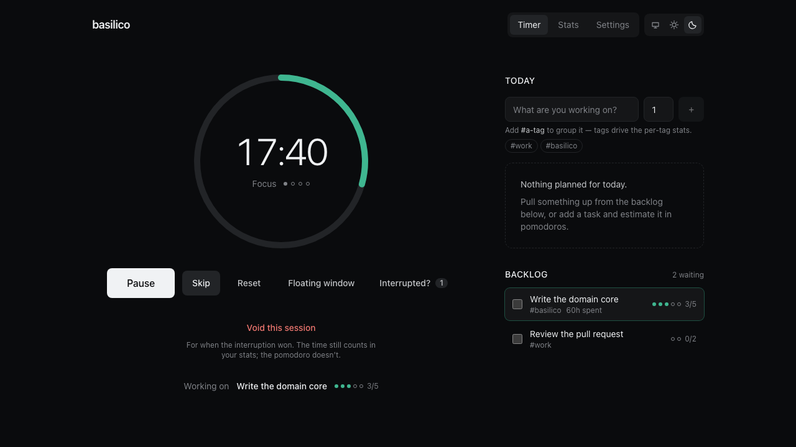
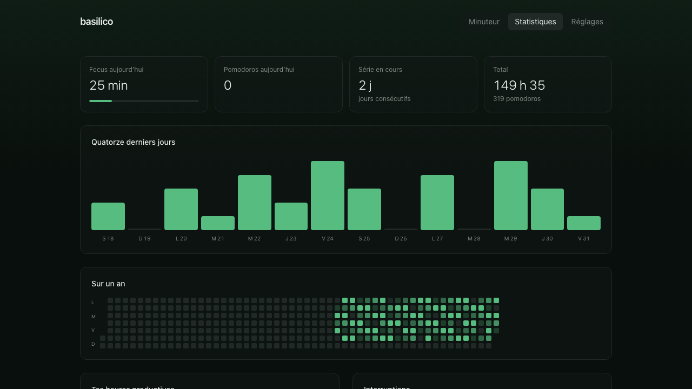

# basilico

[](https://github.com/maxgfr/basilico/actions/workflows/ci.yml)
[](LICENSE)

### **[→ Open the app](https://maxgfr.github.io/basilico/)**

A focus timer built on the Pomodoro Technique®, with tasks, alerts and stats that are actually worth
reading. Everything stays on your machine: no account, no server, no tracking, no ads.



## Why another timer

The timer itself is a solved problem. What's missing everywhere is what comes after it: the history,
the reports, and being able to get your data back out. That's where basilico puts its effort.

|                              |                                                                                                                                                                                                        |
| ---------------------------- | ------------------------------------------------------------------------------------------------------------------------------------------------------------------------------------------------------ |
| **Stats**                    | A year-long heatmap, your streak, time per task and per tag, the hours you're actually productive, and how accurate your estimates are — Cirillo's third objective, which almost no tool reports back. |
| **Interruptions**            | Counted the way the original method does: internal (`'`) and external (`-`). A focus session you truly abandon keeps its time but not its pomodoro — never counted as half a one.                      |
| **Overtime and Flowtime**    | The counter can run past zero, or run as a free stopwatch with a break sized from what you worked. For people whose flow a hard stop at 25 minutes breaks.                                             |
| **Adjustable display**       | Exact, rough ("about 24 minutes"), percentage, or hidden. Watching seconds tick down makes a lot of people anxious.                                                                                    |
| **Endless by default**       | Focus, break, focus, break — the cycle only ends when you end it. Even coming back after an absence picks it back up.                                                                                  |
| **A session journal**        | Jot an intention before a session, a note and a 1–5 rating after. Optional, dismissible, and it feeds a journal on the stats page.                                                                     |
| **Inline tags**              | Type `Write the core #basilico`. Tags drive the per-tag breakdown; no extra field to fill in.                                                                                                          |
| **A backlog and a day plan** | Cirillo's two sheets: an inventory that accumulates everything, and a today list you compose. Unfinished work rolls forward on its own, and the plan tells you what it adds up to in hours.            |
| **Export and import**        | JSON, CSV and [Open Pomodoro Format](https://github.com/open-pomodoro), free and in the open. Your data is yours.                                                                                      |
| **Offline**                  | Installable as a PWA, works with no network.                                                                                                                                                           |



<sub>Screenshots use generated demo data, not real sessions.</sub>

## What you should know before relying on it

These are the usual complaints about web-based timers. Better said upfront.

- **No notification once the tab is closed.** Web Push needs a server and VAPID keys, which this
  project deliberately doesn't have; the API that would have solved it without one (Notification
  Triggers) was abandoned by Chrome. Two answers: basilico **catches up** when you come back — the
  session is recorded at its real end time, with an "ended 15 minutes ago" note — and the
  [Chrome extension](#chrome-extension) genuinely covers the closed-tab case.
- **Your data lives in your browser.** Clearing site data wipes it. Safari additionally deletes all
  storage for sites you haven't visited in 7 days. The app asks for persistent storage and offers a
  one-click export — use it.
- **No sync.** One browser, one history. Export and import to move to another machine.
- **The extension always rings the same alarm.** It runs its own offscreen audio, and the protocol
  only carries the deadline — so the alarm and volume you picked in the app apply to the tab, not to
  the notification the extension fires once that tab is gone.

## Chrome extension

Without it, no notification can fire once the tab is closed. The extension sets a real system alarm
that survives both the tab closing and the service worker going to sleep.

It is deliberately **a notifier, not a second timer**: the app stays the single source of truth and
simply announces its deadline. Two independent timers would drift apart, and you would then have to
decide which one is right.

**Install it**

1. Download `basilico-extension.zip` from the
   [latest release](https://github.com/maxgfr/basilico/releases/latest) — or, for a build of any
   commit, from the **basilico-extension** artifact at the bottom of a
   [CI run](https://github.com/maxgfr/basilico/actions/workflows/ci.yml).
2. Unzip it somewhere you will keep it — Chrome loads the extension from that folder, so don't
   delete it afterwards.
3. Open `chrome://extensions` and turn on **Developer mode** (top right).
4. Click **Load unpacked** and select the unzipped folder.
5. Reload [basilico](https://maxgfr.github.io/basilico/). Settings → Alerts now reads
   _Chrome extension · Installed_.

Prefer building it yourself? `pnpm --filter @basilico/extension build` produces the same folder at
`apps/extension/dist`, which you can load directly at step 4.

It isn't on the Chrome Web Store for now (paid developer account and review delay). The bridge to
the page is a content script restricted to the app's own origin; the extension reads nothing else.

## In your terminal, and in your coding agent

The domain core has no DOM and takes its clock as an argument, so the same timer
runs from a shell. `basilico` is an agent skill: install it once and Claude Code,
Codex and OpenCode can all start a session, note an interruption, and tell you
where the day stands.

```sh
npx skills add maxgfr/basilico --agent '*'
```

No build, no API key, no network — the engine is one self-contained file.

```sh
basilico start --task "Write the core" --intention "finish the stats block"
basilico status                 # phase, cycle, this run, today
basilico done                   # ends it and counts the pomodoro
basilico skip | abandon         # keeps the time, loses the pomodoro
basilico stats --today
```

Add `--json` to any command for machine-readable output, and
`basilico install --all` to wire up `/focus`, `/basilico` and a status bar
showing the phase and the time left.

**There is no sync with the browser, and there cannot be** — `localStorage` is not
readable from a shell and this project runs no server. `basilico export` writes
the same backup Settings → Data reads, and `basilico import` accepts one back.
It is a copy, not a link.

**There is no alarm either.** Without a daemon, a command that is not running
cannot ring. `basilico status` catches up instead: a phase that expired while you
were away is recorded at its real end time, with an "ended 12 minutes ago" note.

## Keyboard shortcuts

| Key       | Action                                  |
| --------- | --------------------------------------- |
| `Space`   | Start or pause                          |
| `R`       | Reset the current phase                 |
| `S`       | Skip to the next phase                  |
| `I` / `E` | Log an internal / external interruption |
| `T`       | Go to stats                             |

## Development

```bash
pnpm install
pnpm dev          # http://localhost:5173
pnpm test         # core + cli + components
pnpm typecheck
pnpm lint
pnpm build
pnpm build:skill  # rebuilds the bundle the skill ships
```

A pnpm monorepo:

- **`packages/core`** — the domain: timer, cycles, sessions, tasks, stats, backups. Plain
  TypeScript, no DOM at all, tested with an injected clock rather than real waiting.
- **`packages/cli`** — the terminal interface, on that same core. Its state file and its clock are
  injected too, so the whole CLI is tested without touching a real disk.
- **`apps/web`** — the React interface and the browser adapters (notifications, audio, storage,
  wake lock).
- **`apps/extension`** — the Chrome MV3 extension.
- **`skills/basilico`** — the agent skill: `SKILL.md` plus a committed esbuild bundle of the CLI,
  since `npx skills add` copies a directory and runs no build. `pnpm check:skill` fails the build
  if that bundle has drifted from its source, and CI runs it.

The timer is driven by an **absolute deadline**, never by a decremented counter: the remaining time
is recomputed from the clock, which makes it immune to background-tab throttling, machine sleep and
page reloads. Design decisions and the reasoning behind them live in
[`docs/design.md`](docs/design.md).

Charts are hand-written SVG: zero dependencies, and every figure is paired with a screen-reader
table — something no canvas charting library can offer.

## Browsers

Chrome 111+, Firefox 128+, Safari 16.4+.

## Contributing

Issues and pull requests are welcome — see [CONTRIBUTING.md](CONTRIBUTING.md).

## Licence

[MIT](LICENSE).

Pomodoro® and The Pomodoro Technique® are registered trademarks of Francesco Cirillo. basilico is
not affiliated with, associated with, or endorsed by Pomodoro®.
